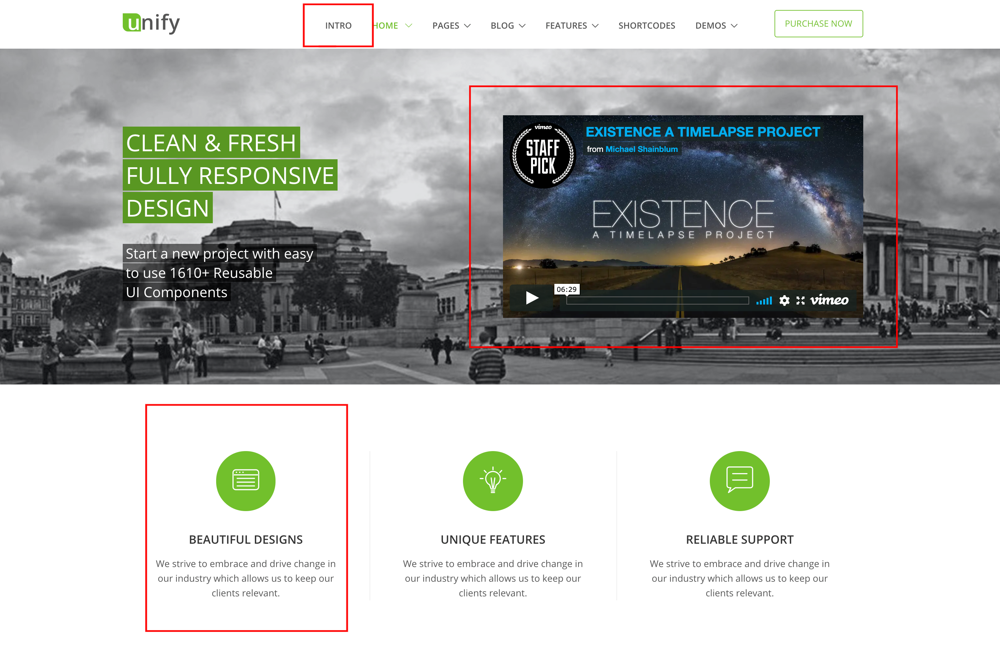
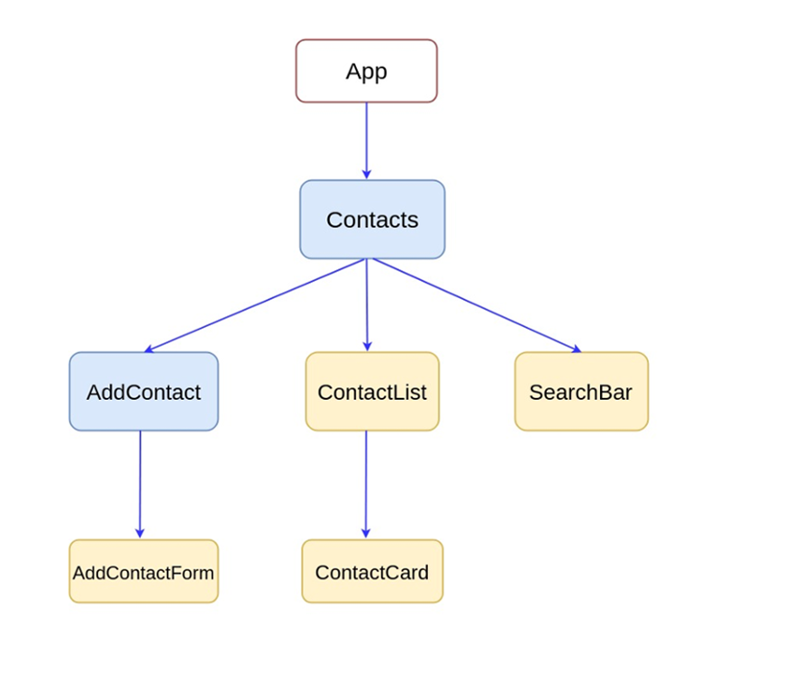

# Reading Material React Week 1

## Agenda

These are the topics for week 1:

1. What is React.js?
   - What React is not
   - Componentization
   - State & Props
   - Lifecycle
2. HTML in JS: JSX
   - JSX
3. Props
   - Unidirectional data flow
4. Deploy a static site
   - What is a static site
   - Static site generators

## 1. What is React.js?

If you go to the official website of [React](https://www.reactjs.org) you'll read the following:

```
A JavaScript library for building user interfaces
```

While completely true, this simple description means quite a lot more to the junior developer. React is a library that provides benefit to both the user and the developer.

For the user the main benefits are that (1) it's really fast, (2) very interactive and (3) like a mobile application. All of this increases the user experiences much more than traditional websites.

For the developer the main benefits are that (1) it allows us to split our application up into smaller pieces (we call them components), (2) we can use the latest version of JavaScript (ES6/7/8), and (3) it is backed by a strong developer community (Facebook and others).

> When learning any technology or package, it's important to keep in mind how well supported by other developers it is. This is important, because you want the technology to be maintained and updated continously. Remember, software always builds on software. It's never isolated. If the technology you've chosen gets outdated it won't work well with other tools anymore. You can't write everything yourself, so if this happens it's best to move on to something better.

Learn more about the React philosophy here:

- [What is React?](https://www.w3schools.com/whatis/whatis_react.asp)
- [The very basics of React](https://blog.cloudboost.io/the-very-basics-of-react-b533a148ce6a)

### What React is not

The longer you look at React code, the harder it seems to distinguish what exactly is it that makes it "React" code. But in reality there's only `JSX`, predefined functions (like `render` or `useState`) and the idea of `component lifecycle` given to us by the React and ReactDOM libraries.

The rest is "just JavaScript": (higher order) functions, importing/exporting, Promises, event listeners and others.

In order to optimally prepare for learning React, therefore, it's important to have strong fundamental understanding of JavaScript. Otherwise you won't be able to make the distinction between what React is and what it is not.

Study the following to learn more:

- [JavaScript for React Developers](https://www.youtube.com/watch?v=NCwa_xi0Uuc)
- [What to Learn Before a JavaScript Framework](https://www.youtube.com/watch?v=qi9VQqYcXqY)

### Componentization

Just like how we say "in HTML everything is a box" and "in JavaScript everything is an object", the same thing can be said about React. However, "in React everything is a component".

But what do we mean by `component`? Simply put: it's a part of a website. For example, take a look at the following image:



The sections with a red outline are examples of a component. Why would we want to split our webpage up into components? **We don't want to rewrite the same code**. Instead, we want to be able to **reuse the same code** structurally, and just be able to change the content.

What do we need to think about when deciding something should be a component? We look at **reusability**. A component looks at the commonalities in parts of the page and extracts them into one mold. Then it provides a way for us to give each `component instance` different content.

The navigation bar in the image is made up of 7 instances of the same component, let's call it `NavbarItem`. We make sure we know what the content is of each instance: in this case the names for each page in the website. And then we just pass those values to each instance.

Essentially, a component is a custom HTML element that we define ourselves.

Learn more by going through the following resources:

- [ReactJS Component LifeCycle](https://www.youtube.com/watch?v=3EbYJrAOpUs)
- [Components and Props](https://reactjs.org/docs/components-and-props.html)

### State & Props

What makes React `dynamic` is the concept of `state`. Simply put, state is the data that moves from component to component. It changes based on the input from the user. Let's say a user logs into their Facebook account. In React terms this is what will happen: A user types in their account details into the login form. This data will be placed into the application state, in real-time.

This means: The other parts of the application knows immediately about the content you've just written! So if we want to use those exact same details to show in the next screen, we can do so without having to send a request to the server. All of this user-specific data stays inside the client.

The other side of `state` is the how we pass it down to our other components. When this happens we call it `props`. It's short for `property`, similar to the properties in HTML elements.

`props` are passed down using a self-defined property name. Take a look at the following example:

```js
const Parent = () => {
  return <Child thisIsaProp={this.state.randomPropName} />;
};
```

The `thisIsaProp` name is something I've created myself, it has no special meaning whatsoever. However, while that is the case it's still important to make any name you give it semantic: it should be meaningful and indicate its purpose. For example:

```js
const Parent = () => {
  return <Child user={this.state.user} />;
};
```

In the above example, the `prop` has a name that describes its contents. From it we can infer that it's probably a user object, with user-specific information.

Learn more about state and props here:

- [State and Lifecycle](https://reactjs.org/docs/state-and-lifecycle.html)
- [ReactJS State Tutorial](https://www.youtube.com/watch?v=O6P86uwfdR0)
- [ReactJS Props](https://www.youtube.com/watch?v=eXQRhVUMCP8)

### Lifecycle

If you only build static websites, you are used to pages rendering instantly after they are send to the client. Whether it comes from the server, or you directly open an HTML file by dragging it into your browser, it displays immediately.

This goes differently in React. Every component has a `lifecycle`. Like a human being, you are born, grow up to do certain activities, and ultimately, pass away. The same thing applies here. Only in the case of React components this happens in 3 main phases:

1. Mounting
2. Updating
3. Unmounting

Each stage serves a different purpose and has different operations to perform. Let's look at each stage separately:

**Mounting**
In this stage the component 'gets born'. In technical terms, it means that it is added to the DOM and now is available for the user to interact with. This is where 'rendering' happens: all the dynamic data gets injected into the HTML and

**Updating**
This is where the state of the complete application is changed. As a result, the components that deal with that state will also update and show different information to the user.

**Unmounting**
In this final stage the component 'passes away'. In technical terms, again, it means that it has served its purpose and is now removed from the DOM.

Learn more about component lifecyle here:

- [React Lifecycle](https://www.w3schools.com/react/react_lifecycle.asp)
- [The Component Lifecycle](https://www.youtube.com/watch?v=_8HU2ZFJEmU)
- [React Component Lifecycle](https://www.youtube.com/watch?v=m_mtV4YaI8c)

## 2. HTML in JS: JSX

### JSX

Take a look at this code:

```js
const Example = () => {
  return <div>This is an example component</div>;
};
```

Can you spot the HTML in the `return` of the function? Well actually, it's not HTML but a special type of JavaScript that is entirely React specific: it's called `JSX`. It stands for JavaScript XML, meaning it's an XML/HTML-like extension to JavaScript.

One of the reasons for the existence of `JSX` goes back to the whole idea of `encapsulating` elements of our webpage: we want to combine HTML, CSS and JavaScript into one so that we can write reusable components that we then just have to copy to wherever we'd like to use them.

In order to write valid `JSX`, we need to import the React library into our file. Without it, it won't be able to interpret it.

Learn more about `JSX` here:

- [Introducing JSX](https://reactjs.org/docs/introducing-jsx.html)

## 3. Props

### Unidrectional dataflow

As we've learned in previous sections, in React data flows from component to component. However, this goes in an organized, tree-like manner. Take a look at the following diagram:



This is how we should think about creating our components: just like with the DOM tree we want to write components in a component tree. Here's how it could look in code:

```js
function App() {
  return (
    <Contacts>
      // The Contacts component has 3 children: AddContact, ContactList and
      SearchBar
      <AddContact>
        // This component has 1 child: AddContactForm
        <AddContactForm />
      </AddContact>
      <ContactList>
        // This component has 1 child: ContactCard
        <ContactCard />
      </ContactList>
      // This component has no children, so is therefore self-closing
      <SearchBar />
    </Contacts>
  );
}
```

As you've learned previously, we use `props` to pass our `state` to our different components. But this doesn't just happen randomly; we do in from top to bottom, or in other words in a `unidirectional flow`. What does this mean? It means that `props` can only be passed **down** the component tree, but never up.

In our example, it means that our `props` can only move from `<Contact>` > `<AddContact>`

- [Unidirectional Data Flow in React](https://flaviocopes.com/react-unidirectional-data-flow/)

## 4. Deploy a static site

### What is a static site

A static website is a collection of HTML, CSS and client-side JavaScript files. That's it. It is usually only a frontend, hosted on a web server that only serves the pages the client asks for (for example, `/`, `/about` or `/privacy`).

As you've learned in the Node.js module, we can use server-side frameworks like `Express` or just native Node.js modules (like `http`) in order to serve our static files to a client.

But what if we don't want to setup a whole web server to do this?

### Static site hosting 

To enable this we use something called a `static site hosting` platform. They take a lot of the basic web server setup out of our hands. All we have to do is upload our frontend (in other words, our static website) to that particular service's web server and that's it. The generator creates a URL for us that we can use to access our website.

Examples of `static site hosting` platforms are the following:

- [Netlify](https://www.netlify.com/)
- [Now](https://zeit.co/)

To learn more about `static site hosting` and how to do it, study the following:

- [A Step-by-Step Guide: Deploying A Static Site or Single-page App](https://www.netlify.com/blog/2016/10/27/a-step-by-step-guide-deploying-a-static-site-or-single-page-app/)

## Finished?

Are you finished with going through the materials? High five! If you feel ready to get practical, click [here](./MAKEME.md).
